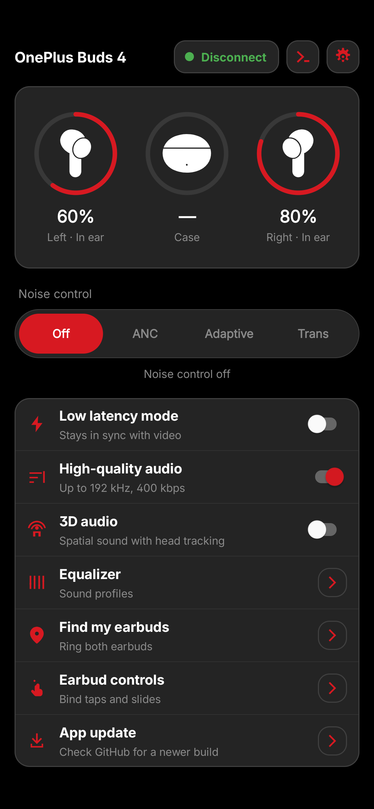
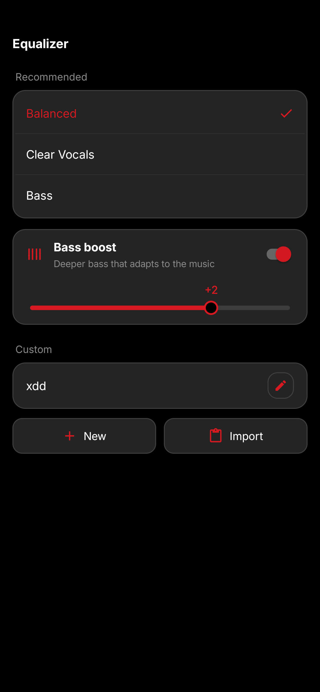
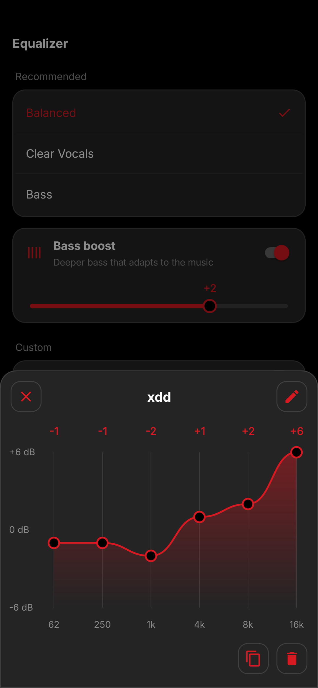
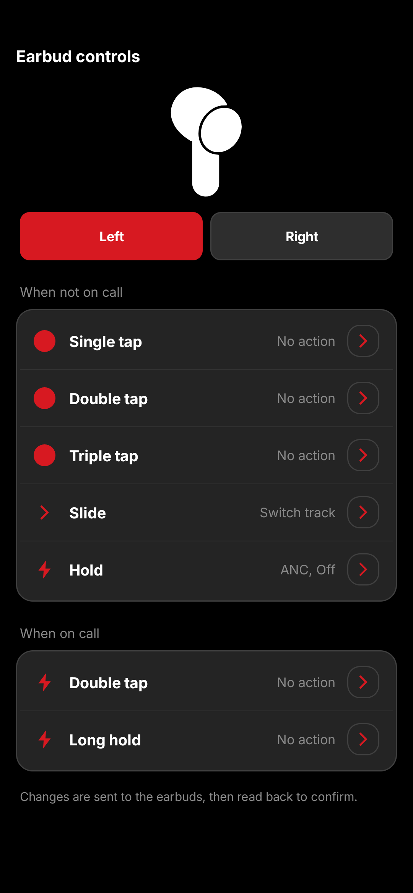
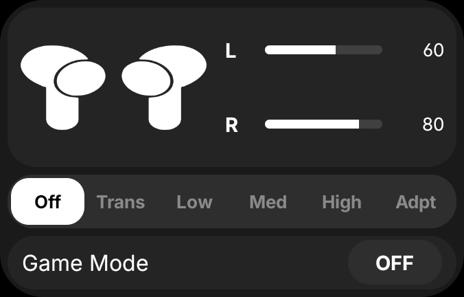

# QuickBuds

> Control OnePlus / OPPO / realme earbuds straight over Bluetooth. No HeyMelody, no root.

QuickBuds does everything the vendor app does for your earbuds, in a fast, clean app with a real
home-screen widget.

## Screenshots

<!-- Retaken with scripts/readme-screenshots.sh; see CLAUDE.md. -->

| Main screen | Equalizer | Curve editor | Earbud gestures | Widget |
| :---: | :---: | :---: | :---: | :---: |
|  |  |  |  |  |

## Features

- **Battery and wear status** for each bud and the case, live.
- **Noise control:** Off, Noise cancelling (Low / Medium / High), Adaptive and Transparency. Changes
  made on the earbuds show up instantly.
- **Equalizer:** built-in presets, up to 3 custom 6-band presets you draw on a curve, and bass boost.
  Saved on the earbuds.
- **High-quality audio (LHDC), 3D audio and Low latency mode.**
- **Gestures** per bud: taps, slide and hold, plus the on-call gestures.
- **Wear detection**, **Dual connection**, **Find my earbuds** and the earbuds' prompt volume.
- **Home-screen widgets** in three sizes (2×2, 4×2, 4×1) with battery, noise control and Low latency,
  in your theme's colours.
- **Themes:** OLED Black, Classic Dark and White, your own accent colour, and up to 3 custom colour
  presets. Reorder or hide the home screen rows.
- **Update check** from inside the app, straight from GitHub releases.

## Install

1. Pair your earbuds in Android's Bluetooth settings first. QuickBuds connects to paired earbuds; it
   does not pair them.
2. Download `QuickBuds<version>.apk` from the
   [latest release](https://github.com/spizganed/QuickBuds/releases/latest) and install it.
3. Allow the Bluetooth permission when asked.

> **Coming from v1.1.0?** Uninstall it first: v2.0.0 and later are signed with a new key.

**Tested on:** OnePlus Buds 4 with a Nothing Phone (3a), Android 15. Other OnePlus / OPPO / realme
earbuds use the same protocol and will likely work, but are untested.

## For developers

Start with [CLAUDE.md](./CLAUDE.md) (toolchain and conventions) and
[PROTOCOL.md](./docs/PROTOCOL.md) (the wire format, every claim tagged with its source). The plan is
in [ROADMAP.md](./docs/ROADMAP.md). `./gradlew assembleDebug` builds a debug APK.

## Credits

The earbud protocol was never publicly documented. QuickBuds stands on the people who worked it out
first; PROTOCOL.md marks every fact taken from them `[OSS]`.

- [**Zhaoyi-ya/OppoPodsManager**](https://github.com/Zhaoyi-ya/OppoPodsManager): the main
  reference. Frame layout and length encoding, most of the command table, the noise control tables,
  the gesture entry shape and the feature IDs.
- [**Star-ZER0/Pods-Protocol-Reverse-Engineering**](https://github.com/Star-ZER0/Pods-Protocol-Reverse-Engineering)
  (CC-BY-SA-4.0, used as documentation): independent confirmation of the framing, and the broadcast
  codes that proved the noise control subscription fix.
- [Leaf-lsgtky/OppoPods](https://github.com/Leaf-lsgtky/OppoPods): early protocol work and part of
  the framing knowledge.
- [Zhaoyi-ya/OPPO-Pods-Win](https://github.com/Zhaoyi-ya/OPPO-Pods-Win): which features each earbud
  model has.
- [ORION2809/DevPods](https://github.com/ORION2809/DevPods): a second implementation to cross-check
  against.

Everything else was captured on real hardware and tested on the device: the gesture values, the
equalizer writes, the hold's noise control cycle and more (see PROTOCOL.md).

## License

Copyright (C) 2026 spizganed

QuickBuds is free software under the GNU General Public License v3.0 or later, distributed without
any warranty; see [LICENSE](./LICENSE). The protocol sources above were used as documentation; check
each one's license before copying text from it.
