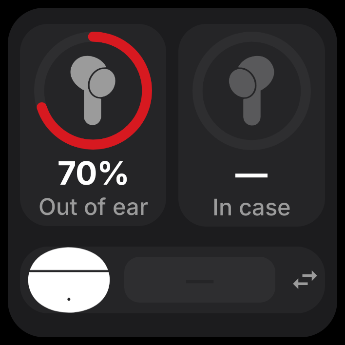
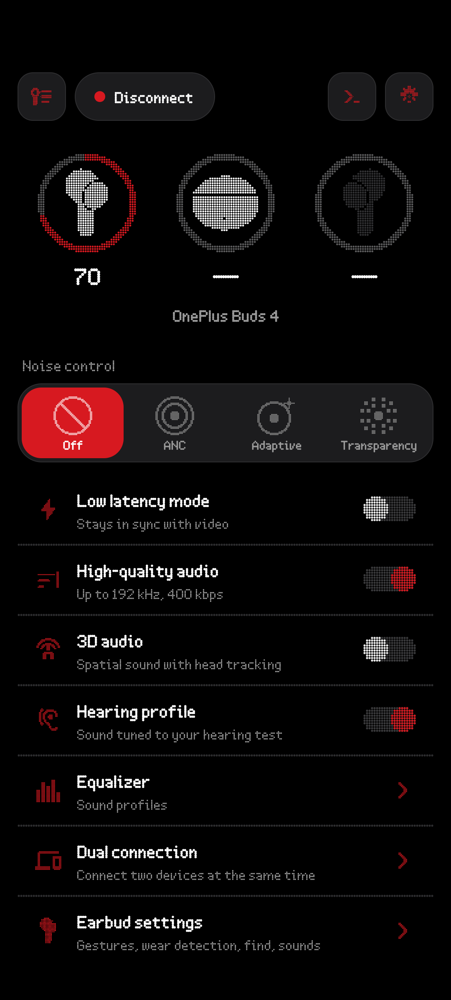
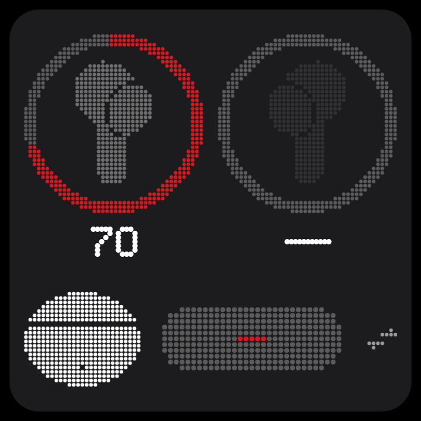

# QuickBuds

> Open-source HeyMelody alternative for Android. Control OnePlus / OPPO / realme earbuds over
> Bluetooth, no root: battery, noise cancellation (ANC), equalizer, gestures, wear detection, find my
> earbuds, dual connection, low latency mode and home screen widgets.

QuickBuds does everything the vendor app does for your earbuds, in a fast, clean app with a real
home-screen widget.

## Screenshots

<!-- Retaken with scripts/readme-screenshots.sh classic, then nothing; see CLAUDE.md. -->

| Main screen | Model | Equalizer | Curve editor |
| :---: | :---: | :---: | :---: |
|  |  |  |  |

| Earbud settings | Earbud gestures | Wear detection | Find my earbuds |
| :---: | :---: | :---: | :---: |
|  |  |  |  |

| Settings | Themes, colors & styles | Edit preset | Home layout |
| :---: | :---: | :---: | :---: |
|  |  |  |  |

| Dual connection | Widget settings | App update | About |
| :---: | :---: | :---: | :---: |
|  |  |  |  |

### Widgets

Every size has a battery page and a controls page; switch with the swap button or a double tap.

| 2x2 | 3x3 | 4x2 |
| :---: | :---: | :---: |
|  |  |  |

### Nothing style

An optional style for the app and the widgets (Themes, colors & styles > Style): Nothing's dot font, no cards,
dot-matrix graphics. Every screen in this style is in [docs/screenshots/nothing](docs/screenshots/nothing).

| Main screen | 3x3 widget |
| :---: | :---: |
|  |  |

## Features

- **Knows your earbuds:** reads the model from the earbuds and matches it against HeyMelody's own
  list of OnePlus, OPPO and realme models, then shows only what that model supports. You can also
  pick the model yourself.
- **Battery and wear status** for each bud and the case, live.
- **Noise control:** Off, Noise cancelling (Low / Medium / High / Smart), Adaptive and Transparency. Changes
  made on the earbuds show up instantly.
- **Equalizer:** built-in presets, up to 3 custom 6-band presets you draw on a curve, and bass boost.
  Saved on the earbuds.
- **High-quality audio (LHDC), 3D audio and Low latency mode.**
- **Gestures** per bud: taps, slide and hold, plus the on-call gestures.
- **Wear detection**, **Dual connection**, **Find my earbuds**, the earbuds' prompt volume and their
  firmware version.
- **Home-screen widgets** in three sizes (2×2, 3×3, 4×2). Each has a battery page and a noise
  control + Low latency page, in your theme's colours.
- **Two styles:** Classic, or a Nothing-style dot-matrix look (Nothing OS's dot font) for the app and
  the widgets.
- **Themes:** OLED Black, Classic Dark and White, or match the system's light / dark setting. Your own
  accent colour and up to 3 custom colour presets. Reorder or hide the home screen rows.
- **27 languages**, switchable inside the app.
- **Update check** from inside the app, straight from GitHub releases.

## Install

1. Pair your earbuds in Android's Bluetooth settings first. QuickBuds connects to paired earbuds; it
   does not pair them.
2. Download `QuickBuds<version>.apk` from the
   [latest release](https://github.com/spizganed/QuickBuds/releases/latest) and install it.
3. Allow the Bluetooth permission when asked.

> **Coming from v1.1.0?** Uninstall it first: v2.0.0 and later are signed with a new key.

**Tested on:** OnePlus Buds 4 with a Nothing Phone (3a), Android 16. Other OnePlus / OPPO / realme
earbuds use the same protocol and are detected, but are untested: reports on GitHub are welcome.

## Supported earbuds

QuickBuds works on **any Android 8+ phone** (Samsung, Google Pixel, Xiaomi, Nothing, Motorola, OnePlus…),
not only on OnePlus / OPPO phones. It knows every model in HeyMelody's own list, 127 earbuds in all,
and shows only the features each one has. Tested on the OnePlus Buds 4; for the others, reports on
GitHub are welcome.

<b>OnePlus</b> (29 models)

OnePlus Bullets Wireless Z2, OnePlus Bullets Wireless Z2 ANC, OnePlus Bullets Wireless Z3, OnePlus Buds, OnePlus Buds Z, OnePlus Buds Pro, OnePlus Buds Z2, OnePlus Nord Buds, OnePlus Buds N, OnePlus Nord Buds CE, OnePlus Buds Pro 2, OnePlus Nord Buds 2, OnePlus Buds Ace, OnePlus Nord Buds 2r, OnePlus Buds Pro 2R, OnePlus Buds 3, OnePlus Buds Pro 3, OnePlus Nord Buds 3 Pro, OnePlus Buds V, OnePlus Buds Ace 2, OnePlus Nord Buds 3, OnePlus Buds 4, OnePlus Nord Buds 3r, OnePlus Open Buds, OnePlus Buds 3V, OnePlus Buds Ace 3, OnePlus Nord Buds 4 Pro, OnePlus Nord Buds 4, OnePlus Flow Buds.

<b>OPPO</b> (52 models)

OPPO Enco Quiet, OPPO Enco M31, OPPO Enco M32, OPPO Enco M33, OPPO Enco Free, OPPO O-Free, OPPO Enco W31, OPPO Enco W51, OPPO Enco W11, OPPO Enco X, OPPO Enco Air, OPPO Enco Play, OPPO Enco Free2, OPPO Enco Buds, OPPO Enco Air Lite, OPPO Enco W31 Lite, OPPO Enco R, OPPO Enco Air2, OPPO Enco Air2 Pro, OPPO Enco X2, OPPO Enco Free2i, OPPO Enco Air2i, OPPO Enco Buds2, OPPO Enco Air3, OPPO Enco R Pro, OPPO Enco R2, OPPO Enco Air3 Pro, OPPO Enco Free3, OPPO Enco X3i, OPPO Enco Air3i, OPPO Enco X3, OPPO Enco Air3s, OPPO Enco Air4 Pro, OPPO Enco Buds2 Pro, OPPO Enco R3, OPPO Enco Air 3i, OPPO Enco Free4, OPPO Enco Air4, OPPO Enco Air4i, OPPO Enco R3 Pro, OPPO Enco Buds3 Pro+, OPPO Enco Buds3, OPPO Enco Buds3 Pro, OPPO Enco R4, OPPO Enco R5, OPPO Enco Clip, OPPO Enco X3s, OPPO Enco Air5 Pro, OPPO Enco Air5s, OPPO Enco Air5, OPPO Enco Clip2, OPPO Enco Air4s.

<b>realme</b> (43 models)

realme Buds Wireless 2S, realme Buds Wireless 3, realme Buds Wireless 3 Neo, realme Buds Wireless 5 ANC, realme Buds Wireless 6 Neo, realme Buds Wireless 6, realme Buds Wireless 6 ANC, realme Buds Air 3, realme Buds Q2s, realme Buds Air 3S, realme Buds T100, realme Buds Air 3 Neo, realme Buds Air 5 Pro, realme Buds Air 5, realme Buds T300, realme Buds T110, realme Buds Air6 Pro, realme Buds Air6, realme Buds N1 Pro, realme Buds T310, realme Buds N1, realme Buds T01, realme Buds Air7, realme Buds Air7 Pro, realme Buds T200 Lite, realme Buds T200, realme Buds T200x, realme Buds Clip, realme TechLife Buds, realme Buds T500 Pro, realme Buds Air8, realme Buds Air8 Pro, realme Buds T500, realme Buds T500 Pro Harry Potter Edition, realme Buds Air 2 Neo, realme Buds Air, realme Buds Q2, realme Buds Air Pro, realme Buds Air 2, realme Buds Wireless 2, realme Buds Wireless 2 Neo, realme Buds Wireless Pro, realme Buds Air Neo.

<b>DIZO</b> (3 models)

DIZO Wireless, DIZO GoPods D, DIZO GoPods.

## For developers

Start with [CLAUDE.md](./CLAUDE.md) (toolchain and conventions) and
[PROTOCOL.md](./docs/PROTOCOL.md) (the wire format, every claim tagged with its source). The plan is
in [ROADMAP.md](./docs/ROADMAP.md). `./gradlew assembleDebug` builds a debug APK.

## Credits

The earbud protocol was never publicly documented. QuickBuds stands on the people who worked it out
first; PROTOCOL.md marks every fact taken from them `[OSS]`.

- [**Zhaoyi-ya/OppoPodsManager**](https://github.com/Zhaoyi-ya/OppoPodsManager): the main
  reference. Frame layout and length encoding, most of the command table, the noise control tables,
  the gesture entry shape and the feature IDs.
- [**Star-ZER0/Pods-Protocol-Reverse-Engineering**](https://github.com/Star-ZER0/Pods-Protocol-Reverse-Engineering)
  (CC-BY-SA-4.0, used as documentation): independent confirmation of the framing, and the broadcast
  codes that proved the noise control subscription fix.
- [Leaf-lsgtky/OppoPods](https://github.com/Leaf-lsgtky/OppoPods): early protocol work and part of
  the framing knowledge.
- [Zhaoyi-ya/OPPO-Pods-Win](https://github.com/Zhaoyi-ya/OPPO-Pods-Win): which features each earbud
  model has.
- [ORION2809/DevPods](https://github.com/ORION2809/DevPods): a second implementation to cross-check
  against.

Everything else was captured on real hardware and tested on the device: the gesture values, the
equalizer writes, the hold's noise control cycle and more (see PROTOCOL.md).

## License

Copyright (C) 2026 spizganed

QuickBuds is free software under the GNU General Public License v3.0 or later, distributed without
any warranty; see [LICENSE](./LICENSE). The protocol sources above were used as documentation; check
each one's license before copying text from it.
