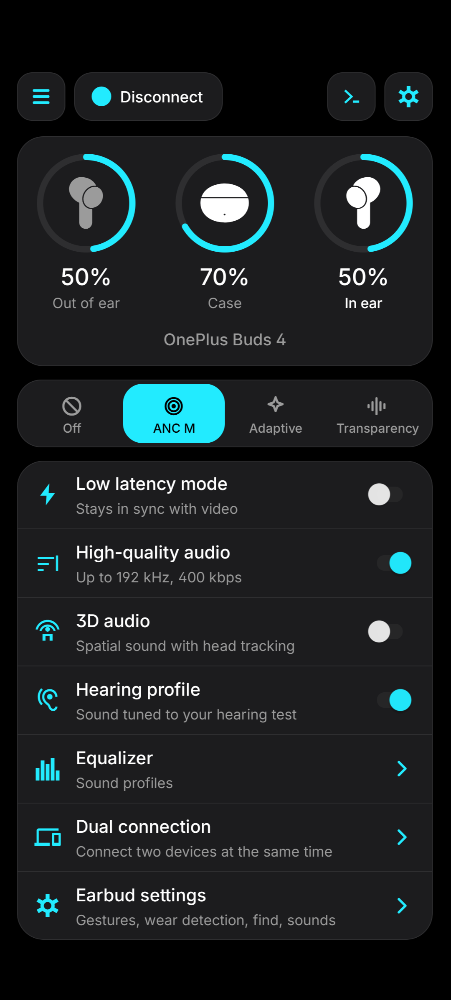
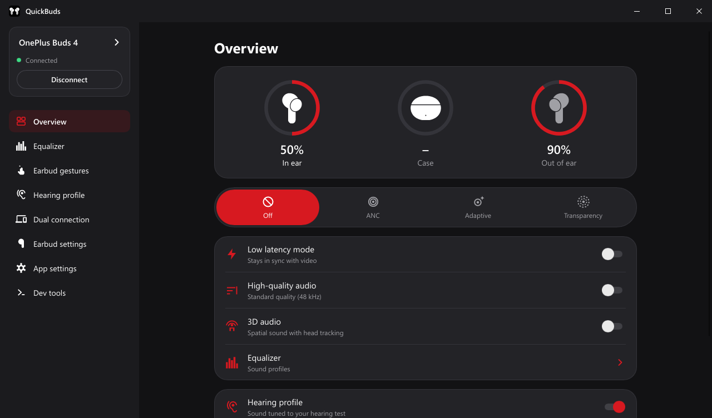
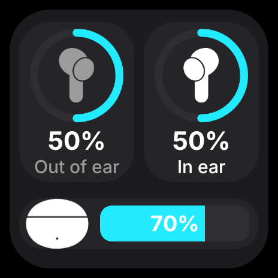
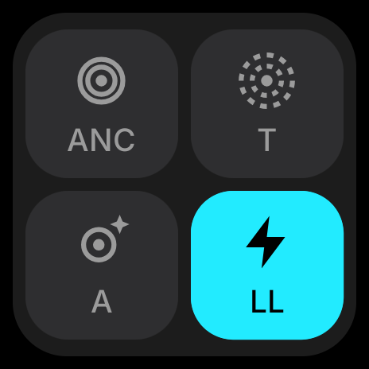
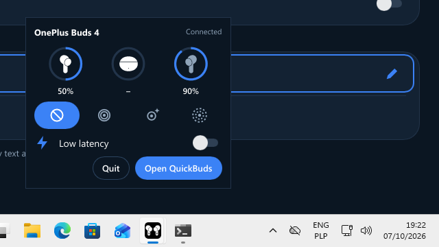

# QuickBuds

> Open-source HeyMelody alternative for Android, Windows and Linux. Control OnePlus / OPPO / realme
> earbuds over Bluetooth, no root: battery, noise cancellation (ANC), equalizer, hearing profile,
> gestures, wear detection, fit test, find my earbuds, dual connection, low latency mode, home screen
> widgets and a tray icon.

[](./LICENSE)
[]()
[](https://github.com/spizganed/QuickBuds/releases/latest)
[](https://ko-fi.com/spizganed)

QuickBuds does everything the vendor app does for your earbuds, in a fast, clean app: on the phone,
with real home screen widgets, and on the PC, with a tray icon. One release has both.

QuickBuds is purely a passion and hobby project. If you like it and want to help out, feel free to
donate on [Ko-fi](https://ko-fi.com/spizganed).

## Screenshots

| Phone | PC |
| :---: | :---: |
|  |  |

| Widget: battery | Widget: noise control | Tray: Windows | Tray: Linux |
| :---: | :---: | :---: | :---: |
|  |  |  |  |

## Features

- **Knows your earbuds:** reads the model from the earbuds and matches it against HeyMelody's and realme
  Link's lists of OnePlus, OPPO and realme models, then shows only what that model supports. You can also
  pick the model yourself.
- **Battery and wear status** for each bud and the case, live.
- **Noise control:** Off, Noise cancelling (Low / Medium / High / Smart), Adaptive and Transparency. Changes
  made on the earbuds show up instantly.
- **Equalizer:** built-in presets, up to 3 custom presets you draw on a curve, and bass boost.
  Saved on the earbuds.
- **High-quality audio (LHDC), 3D audio and Low latency mode.**
- **Hearing profile:** a hearing test (ear scan, then 6 tones per ear) that tunes the sound to your
  ears, run in the app. Profiles are kept in the app, one tap applies one, and a graph per ear shows
  what it does. Profiles made in HeyMelody show up too.
- **Earbud fit test:** checks that the ear tips seal well.
- **Gestures** per bud: taps, slide and hold, plus the on-call gestures.
- **Wear detection**, **Dual connection**, **Find my earbuds**, the earbuds' prompt volume and their
  firmware version.
- **Whatever else your model has:** 3D audio with head tracking, game sound effects, vocal enhancement,
  smart / adaptive volume, power saving and more, each shown only where the earbuds support it.
- **Home screen widgets** (Android) in two sizes (2×2, 4×2). Each has a battery page and a noise
  control + Low latency page, in your theme's colours. A double tap switches the page.
- **Tray icon** (PC): on Windows it opens quick controls, on Linux its menu shows the battery.
- **Two styles:** Classic, or a dot-matrix look (a dot font, no cards, dot-matrix graphics).
- **Themes:** OLED Black, Classic Dark and White, or match the system's light / dark setting. Your own
  accent colour and up to 3 custom colour presets. Reorder or hide the home screen rows.
- **27 languages**, switchable inside the app.
- **Updates** from inside the app, straight from GitHub releases. The PC app updates itself.
- **With Dual connection on**, the phone app and the PC app work at the same time.

## Install

Pair your earbuds in the system's Bluetooth settings first. QuickBuds connects to paired earbuds; it
does not pair them. Every file is in the [latest release](https://github.com/spizganed/QuickBuds/releases/latest).

- **Android 8+:** install `QuickBuds<version>.apk` and allow the Bluetooth permission when asked.
- **Windows 10 / 11:** unzip `QuickBuds<version>-windows-x64.zip` and run `quickbuds.exe`. It is portable:
  no installer, no drivers, no background services.
- **Linux:** unpack `QuickBuds<version>-linux-x64.tar.gz`. It needs BlueZ, GTK 3 and
  libayatana-appindicator; its README has the rest.
- **Arch Linux:** build the package from the repo (it goes to the AUR as `quickbuds-bin` when AUR
  sign-ups open again):

  ```bash
  git clone https://github.com/spizganed/QuickBuds && cd QuickBuds/desktop/aur && makepkg -si
  ```

> **Got the APK somewhere else?** The only official downloads are the GitHub releases. A copy from
> another site is genuine only if it is signed with this certificate (SHA-256), which
> `apksigner verify --print-certs <apk>` shows:
> `9ae0ea888079cbd86af5a24391cd351af4a81fc04ebe9bd8429074c736249f61`

## Supported earbuds

QuickBuds works on **any Android 8+ phone** (Samsung, Google Pixel, Xiaomi, Nothing, Motorola, OnePlus…),
not only on OnePlus / OPPO phones. It knows every earbud in HeyMelody's and realme Link's lists, 127 in
all, and shows only the features each one has.

<details open><summary><b>Confirmed</b> (3 models)</summary>

<details><summary><b>OnePlus</b> (1)</summary>

- **OnePlus Buds 4**: fully working. Every feature tested on a Nothing Phone (3a), Android 16, and on Windows and Linux.

</details>

<details><summary><b>OPPO</b> (1)</summary>

- **OPPO Enco Buds2**: confirmed by its owner on Windows: connection, equalizer, battery.

</details>

<details><summary><b>realme</b> (1)</summary>

- **realme Buds Air7 Pro**: confirmed by its owner on Android and Windows: noise control, gestures, 3D audio.

</details>

</details>

<details><summary><b>Not confirmed yet</b> (124 models)</summary>

Detected, with features built from HeyMelody's and realme Link's data. Some may not work.

<details><summary><b>OnePlus</b> (28 models)</summary>

OnePlus Bullets Wireless Z2, OnePlus Bullets Wireless Z2 ANC, OnePlus Bullets Wireless Z3, OnePlus Buds, OnePlus Buds Z, OnePlus Buds Pro, OnePlus Buds Z2, OnePlus Nord Buds, OnePlus Buds N, OnePlus Nord Buds CE, OnePlus Buds Pro 2, OnePlus Nord Buds 2, OnePlus Buds Ace, OnePlus Nord Buds 2r, OnePlus Buds Pro 2R, OnePlus Buds 3, OnePlus Buds Pro 3, OnePlus Nord Buds 3 Pro, OnePlus Buds V, OnePlus Buds Ace 2, OnePlus Nord Buds 3, OnePlus Nord Buds 3r, OnePlus Open Buds, OnePlus Buds 3V, OnePlus Buds Ace 3, OnePlus Nord Buds 4 Pro, OnePlus Nord Buds 4, OnePlus Flow Buds.

</details>

<details><summary><b>OPPO</b> (51 models)</summary>

OPPO Enco Quiet, OPPO Enco M31, OPPO Enco M32, OPPO Enco M33, OPPO Enco Free, OPPO O-Free, OPPO Enco W31, OPPO Enco W51, OPPO Enco W11, OPPO Enco X, OPPO Enco Air, OPPO Enco Play, OPPO Enco Free2, OPPO Enco Buds, OPPO Enco Air Lite, OPPO Enco W31 Lite, OPPO Enco R, OPPO Enco Air2, OPPO Enco Air2 Pro, OPPO Enco X2, OPPO Enco Free2i, OPPO Enco Air2i, OPPO Enco Air3, OPPO Enco R Pro, OPPO Enco R2, OPPO Enco Air3 Pro, OPPO Enco Free3, OPPO Enco X3i, OPPO Enco Air3i, OPPO Enco X3, OPPO Enco Air3s, OPPO Enco Air4 Pro, OPPO Enco Buds2 Pro, OPPO Enco R3, OPPO Enco Air 3i, OPPO Enco Free4, OPPO Enco Air4, OPPO Enco Air4i, OPPO Enco R3 Pro, OPPO Enco Buds3 Pro+, OPPO Enco Buds3, OPPO Enco Buds3 Pro, OPPO Enco R4, OPPO Enco R5, OPPO Enco Clip, OPPO Enco X3s, OPPO Enco Air5 Pro, OPPO Enco Air5s, OPPO Enco Air5, OPPO Enco Clip2, OPPO Enco Air4s.

</details>

<details><summary><b>realme</b> (42 models)</summary>

realme Buds Wireless 2S, realme Buds Wireless 3, realme Buds Wireless 3 Neo, realme Buds Wireless 5 ANC, realme Buds Wireless 6 Neo, realme Buds Wireless 6, realme Buds Wireless 6 ANC, realme Buds Air 3, realme Buds Q2s, realme Buds Air 3S, realme Buds T100, realme Buds Air 3 Neo, realme Buds Air 5 Pro, realme Buds Air 5, realme Buds T300, realme Buds T110, realme Buds Air6 Pro, realme Buds Air6, realme Buds N1 Pro, realme Buds T310, realme Buds N1, realme Buds T01, realme Buds Air7, realme Buds T200 Lite, realme Buds T200, realme Buds T200x, realme Buds Clip, realme TechLife Buds, realme Buds T500 Pro, realme Buds Air8, realme Buds Air8 Pro, realme Buds T500, realme Buds T500 Pro Harry Potter Edition, realme Buds Air 2 Neo, realme Buds Air, realme Buds Q2, realme Buds Air Pro, realme Buds Air 2, realme Buds Wireless 2, realme Buds Wireless 2 Neo, realme Buds Wireless Pro, realme Buds Air Neo.

</details>

<details><summary><b>DIZO</b> (3 models)</summary>

DIZO Wireless, DIZO GoPods D, DIZO GoPods.

</details>

</details>

**Own other buds? Please tell us what works.** Open an [issue](https://github.com/spizganed/QuickBuds/issues)
with your model, what works and what does not, and a log: Dev tools › Export (the file lands in
`Download/QuickBuds/`), or a Bluetooth HCI snoop log / `adb logcat`. Settings › Report a problem sends
the same without a GitHub account. Each report lets the next release fix
that model. The app asks the same once, on first launch.

## For developers

- [CONTRIBUTING.md](./docs/CONTRIBUTING.md): build quickstart (Android and desktop), where things are, the rules that matter.
- [PACKET-CAPTURE.md](./docs/PACKET-CAPTURE.md): capturing the earbuds' traffic, HeyMelody's included.
- [PROTOCOL.md](./docs/PROTOCOL.md): the wire format, every claim tagged with its source.
- [ROADMAP.md](./docs/ROADMAP.md): the plan, and the features decided against.

## Credits

The earbud protocol was never publicly documented. QuickBuds stands on the people who worked it out
first; PROTOCOL.md marks every fact taken from them `[OSS]`.

- [**Zhaoyi-ya/OppoPodsManager**](https://github.com/Zhaoyi-ya/OppoPodsManager): the main
  reference. Frame layout and length encoding, most of the command table, the noise control tables,
  the gesture entry shape and the feature IDs.
- [**Star-ZER0/Pods-Protocol-Reverse-Engineering**](https://github.com/Star-ZER0/Pods-Protocol-Reverse-Engineering)
  (CC-BY-SA-4.0, used as documentation): independent confirmation of the framing, and the broadcast
  codes that proved the noise control subscription fix.
- [Leaf-lsgtky/OppoPods](https://github.com/Leaf-lsgtky/OppoPods): early protocol work and part of
  the framing knowledge.
- [Zhaoyi-ya/OPPO-Pods-Win](https://github.com/Zhaoyi-ya/OPPO-Pods-Win): which features each earbud
  model has.
- [ORION2809/DevPods](https://github.com/ORION2809/DevPods): a second implementation to cross-check
  against.

Everything else was captured on real hardware and tested on the device: the gesture values, the
equalizer writes, the hold's noise control cycle and more (see PROTOCOL.md).

The desktop app is built with [Slint](https://slint.dev) (used under the GPLv3) and
[tray-icon](https://github.com/tauri-apps/tray-icon).

The Dot matrix style's font is [Doto](https://github.com/oliverlalan/Doto) (SIL Open Font License 1.1,
bundled with its license in `app/src/main/assets/Doto-OFL.txt`).

## License

Copyright (C) 2026 spizganed

QuickBuds is free software under the GNU General Public License v3.0 or later, distributed without
any warranty; see [LICENSE](./LICENSE). The protocol sources above were used as documentation; check
each one's license before copying text from it.

QuickBuds is an independent project, not affiliated with, endorsed by or sponsored by OnePlus, OPPO,
realme, HeyTap or any of their affiliates. OnePlus, OPPO, realme, HeyMelody and the earbud model names
are trademarks of their respective owners and are used here only to say which devices the app works
with. The protocol was studied only to make these earbuds work with this app.
